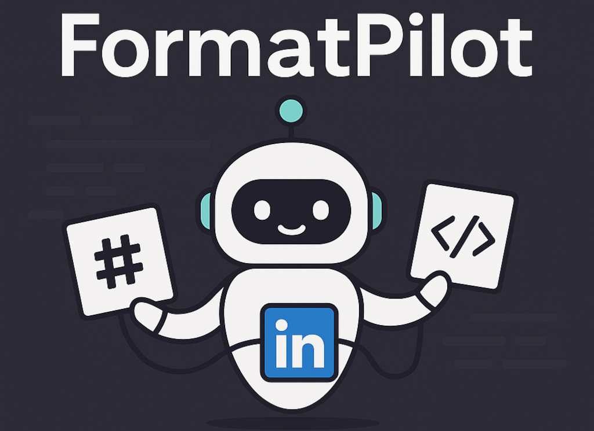

# 

---

🚀 **Convert text between multiple formats (Markdown ↔ LinkedIn ↔ HTML) directly in VS Code!**

---

[](https://marketplace.visualstudio.com/items?itemName=rafa-mori.formatpilot)
[](https://opensource.org/licenses/MIT)
[](https://www.typescriptlang.org/)

> Simple and fast text conversion between Markdown, LinkedIn, and HTML formats. No external dependencies, pure TypeScript implementation!

## ✨ Features

- 🔄 **Multiple Conversions**: Markdown → LinkedIn, Markdown → HTML, HTML → Markdown
- ⚡ **Lightning Fast**: Native TypeScript implementation, no Python dependencies
- 🎯 **Context Menu**: Right-click on selected text for quick conversion
- 📱 **LinkedIn Optimized**: Proper formatting for LinkedIn posts with character warnings
- 🌐 **HTML Ready**: Clean HTML output with proper tags
- 📝 **Markdown Compatible**: Converts HTML back to clean Markdown

## 🚀 Installation

1. Open VS Code
2. Go to Extensions (`Ctrl+Shift+X`)
3. Search for "FormatPilot"
4. Click Install
5. Start converting text!

## 🎯 How to Use

### Quick Conversion

1. **Select** any text in your editor
2. **Right-click** → "🚀 FormatPilot" → Choose conversion type
3. **Done!** Your text is converted instantly

### Available Commands

- `FormatPilot: Convert Text` - Shows conversion options
- `FormatPilot: Convert to LinkedIn` - Direct Markdown → LinkedIn
- `FormatPilot: Convert to HTML` - Direct Markdown → HTML  
- `FormatPilot: Convert to Markdown` - Direct HTML → Markdown

## 📋 Examples

### Markdown → LinkedIn

**Input:**

```markdown
# My Great Post
This is **important** text with *emphasis*.
- Point 1
- Point 2
Check out [my website](https://example.com)
```

**Output:**

```text
MY GREAT POST
This is IMPORTANT text with emphasis.
• Point 1
• Point 2
Check out my website (https://example.com)
```

### Markdown → HTML

**Input:**

```markdown
## Header
**Bold** and *italic* text
- List item
```

**Output:**

```html
<h2>Header</h2>
<p><strong>Bold</strong> and <em>italic</em> text</p>
<ul>
  <li>List item</li>
</ul>
```

### HTML → Markdown

**Input:**

```html
<h1>Title</h1>
<p><strong>Bold</strong> text</p>
<ul><li>Item</li></ul>
```

**Output:**

```markdown
# Title
**Bold** text
- Item
```

## 🔧 Features Detail

### LinkedIn Conversion

- Removes Markdown formatting (LinkedIn doesn't support it)
- Converts bold text to UPPERCASE
- Converts lists to bullet points (•)
- Formats links as "text (url)"
- Warns if text exceeds 3000 characters

### HTML Conversion

- Preserves all formatting as HTML tags
- Handles nested lists properly
- Converts code blocks to `<pre><code>`
- Maintains link structure

### Markdown Conversion

- Cleans HTML tags back to Markdown syntax
- Handles complex nested structures
- Preserves links and images
- Decodes HTML entities

## 🛠️ Development

### Build from Source

```bash
git clone https://github.com/rafa-mori/formatpilot-vscode.git
cd formatpilot-vscode
npm install
npm run compile
```

### Package Extension

```bash
npm run package
```

## 🤝 Contributing

Contributions are welcome! Please feel free to submit issues or pull requests.

1. Fork the repository
2. Create your feature branch (`git checkout -b feature/new-feature`)
3. Commit your changes (`git commit -am 'Add new feature'`)
4. Push to the branch (`git push origin feature/new-feature`)
5. Open a Pull Request

## 📄 License

MIT © Rafael Mori

## 💌 Contact

- [GitHub](https://github.com/rafa-mori)
- [Email](mailto:faelmori@gmail.com)

---

Made with ❤️ by Rafael Mori
