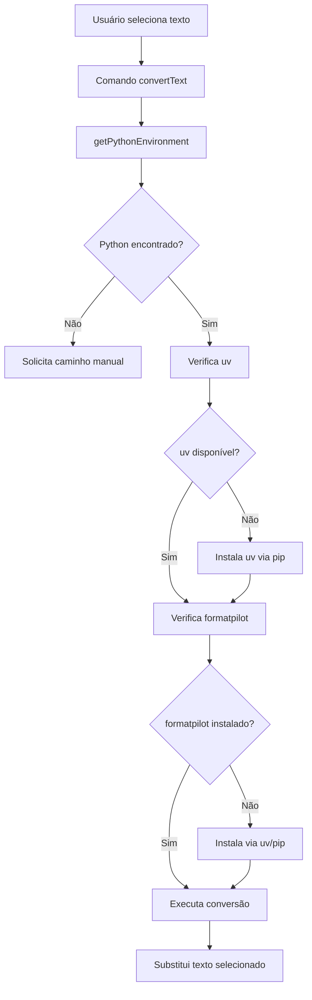

# FormatPilot VS Code Extension - Documentação Técnica

## 🏗️ Arquitetura

### Componentes Principais

#### FormatPilotManager
Classe principal que gerencia todo o ciclo de vida da extensão:

- **Detecção de Ambiente**: Encontra Python, uv e formatpilot
- **Gerenciamento de Dependências**: Instala automaticamente o que falta
- **Interface de Usuário**: Status bar, notificações e comandos
- **Execução de Conversões**: Coordena as conversões de texto

#### Comandos Disponíveis

1. **`formatpilot.convertText`**
   - Função principal de conversão
   - Ativado quando há texto selecionado
   - Suporta Markdown → LinkedIn/HTML e HTML → Markdown

2. **`formatpilot.setup`**
   - Configura o ambiente Python
   - Instala dependências se necessário
   - Útil para configuração inicial

3. **`formatpilot.checkStatus`**
   - Verifica status do ambiente
   - Mostra informações de debug
   - Acessível via status bar

### Fluxo de Execução



## 🔧 Configurações

### formatpilot.pythonPath
- **Tipo**: string
- **Padrão**: ""
- **Descrição**: Caminho customizado para executável Python
- **Uso**: Quando auto-detecção falha

### formatpilot.useUv
- **Tipo**: boolean
- **Padrão**: true
- **Descrição**: Usar uv em vez de pip
- **Vantagem**: Instalações mais rápidas

### formatpilot.autoInstall
- **Tipo**: boolean
- **Padrão**: true
- **Descrição**: Instalar dependências automaticamente
- **Nota**: Quando false, pergunta ao usuário

### formatpilot.showNotifications
- **Tipo**: boolean
- **Padrão**: true
- **Descrição**: Mostrar notificações de sucesso/erro
- **Uso**: Para ambientes automatizados

## 🔍 Detecção de Ambiente

### Estratégias de Detecção do Python

1. **Configuração Manual**
   - Verifica `formatpilot.pythonPath`
   - Valida se arquivo existe

2. **Extensão Python VS Code**
   - Usa API da extensão ms-python.python
   - Obtém configuração ativa

3. **PATH do Sistema**
   - Busca por `python3`, `python`, `py`
   - Usa `which`/`where` conforme plataforma

4. **Input Manual**
   - Solicita caminho via input box
   - Valida e salva para futuro uso

### Verificação de Dependências

```typescript
// Verifica uv
const uvPath = await this.checkUvInstallation(pythonPath);

// Verifica formatpilot
const hasFormatpilot = await this.checkFormatpilotInstallation(pythonPath, uvPath);
```

## 🚀 Performance

### Otimizações com uv

- **Instalação**: ~3x mais rápida que pip
- **Resolução**: Algoritmo mais eficiente
- **Cache**: Melhor gerenciamento de cache
- **Paralelismo**: Downloads paralelos

### Timeout e Limites

- **Conversão**: 30 segundos timeout
- **Instalação**: Sem timeout (pode ser lenta)
- **Buffer**: 1MB máximo para saída

## 🐛 Debugging

### Canal de Output

Todas as operações são logadas no canal "FormatPilot":
```typescript
this.outputChannel.appendLine(`[${new Date().toISOString()}] ${message}`);
```

### Verificação Manual

Use o comando `FormatPilot: Check Status` para ver:
- Versão do Python
- Status do uv
- Status do formatpilot
- Caminho do executável

### Logs Importantes

- Detecção de Python
- Instalação de dependências  
- Execução de conversões
- Erros e exceções

## 🔒 Segurança

### Execução de Código

- Usa `execSync` com timeout
- Escapa caracteres especiais
- Limita buffer de saída
- Valida caminhos antes da execução

### Dependências

- Instala apenas formatpilot oficial
- Verifica integridade via pip show
- Não executa código arbitrário

## 🧪 Testes

### Estrutura de Testes

```
src/test/
├── extension.test.ts    # Testes principais
└── suite/
    ├── index.ts        # Configuração da suite
    └── ...             # Testes específicos
```

### Cobertura

- Registro de comandos
- Configurações
- Ativação da extensão
- Interface básica

### Execução

```bash
npm run test
```

## 📦 Build e Deploy

### Desenvolvimento

```bash
npm run watch          # Watch mode
npm run compile        # Compilação única
npm run lint          # Linting
```

### Produção

```bash
npm run package       # Gera .vsix
vsce publish         # Publica no marketplace
```

### Estrutura de Saída

```
dist/
└── extension.js      # Bundle final
```
